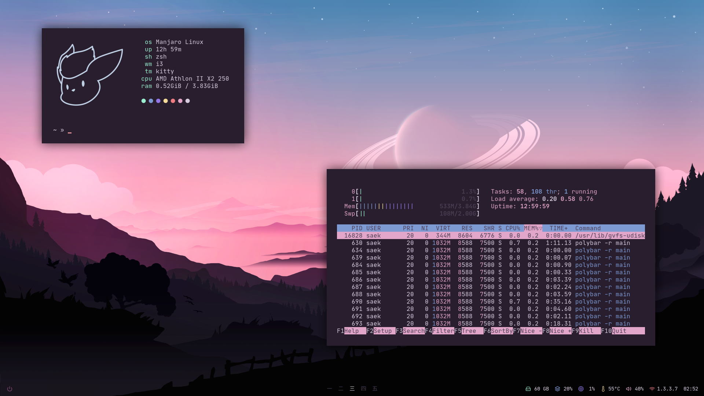

# Dots (e6 variant)

[Background](bg.png)

Dotfiles exclusively for [i3](https://github.com/Airblader/i3).

> ⚠️ **Before you install**
> * Do a backup of your dotfiles.
> * Do a double check of the `i3` config file (`.config/i3/config` again, in the repo folder) and make sure all it's ok for your environment.

## packages
* [a forked version of picom](https://github.com/ibhagwan/picom)
* [polybar](https://github.com/polybar/polybar)
* [feh](https://github.com/derf/feh)
* [rofi](https://github.com/davatorium/rofi)

## optional packages
* [kitty](https://github.com/kovidgoyal/kitty)
* [cava](https://github.com/karlstav/cava)
* [zsh](https://github.com/ohmyzsh/ohmyzsh)

## polybar - third party modules
* [polybar-spotify](https://github.com/Jvanrhijn/polybar-spotify) (already included in this repo, might be outdated)

## other
* **font** [JetBrainsMono Nerd Font](https://www.nerdfonts.com/font-downloads)
* **icons** Feather Icons ([source](https://github.com/feathericons/feather))
* **power menu** [rofi-power-menu](https://github.com/jluttine/rofi-power-menu)

## quick install (Arch)
1. Install required packages.
```sh
yay -S picom-ibhagwan-git polybar feh rofi
```
2. Clone the repo and `cd` to it.
```sh
git clone https://github.com/Saektide/dots.git && cd dots
```
3. Run the apply script with the option to restart the i3 instance.
```sh
sudo ./apply.sh -r
```
4. Install [rofi-power-menu](https://github.com/jluttine/rofi-power-menu).

## apply script (options)
* `-h` Show the help screen.
* `-c` Select a module/package to apply the desired config.
* `-r` Restart the i3 instance after apply process.
* `-b` Bypass the confirmation (press any key to continue).
* `-o` Apply files that are in the `.other` folder.

### examples
Apply dotfiles only for `rofi` and bypass the confirmation prompt.
```sh
sudo ./apply.sh -c rofi -b
```
Apply dotfiles only for `i3`, bypass the confirmation prompt and restart the i3 instance.
```sh
sudo ./apply.sh -c i3 -b -r
```

## updating
If you want to keep up-to-date your dotfiles with this repo, do a `cd` to the repo folder, pull the changes and re-apply them.
```
git pull && sudo ./apply.sh
```

## switch variant
Make sure you've updated this repo in your local machine, you can see the available branches of variants by using `git branch` command.
```sh
git branch -a
```
For example, if you want to use the `boundaries` variant, simply use this:
```sh
git checkout boundaries
```

## troubleshooting

### I have another version of picom.
Simply remove that version and install the ibhagwan's version. Kill the process (`pkill picom`) before do this. If you're in Arch simply do `yay -R picom` and then `yay -S picom-ibhagwan-git`.

### It looks different on my screen...
If you have any problem installing the dotfiles, open an [issue](https://github.com/Saektide/dots/issues) and don't forget to provide logs and your machine info (use `neofetch` or similar), you can provide screenshots if needed!
